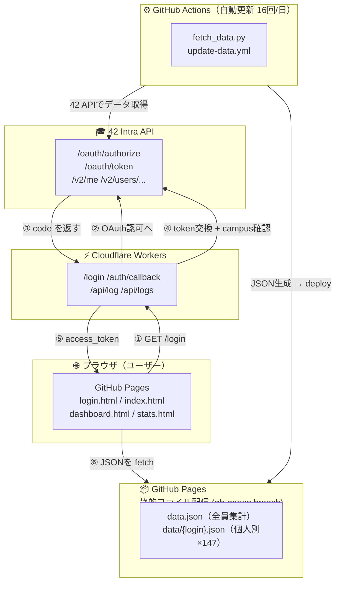
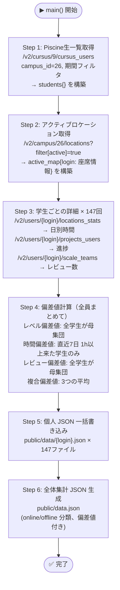
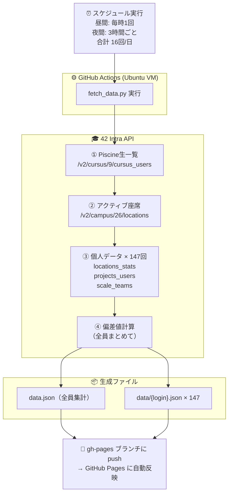
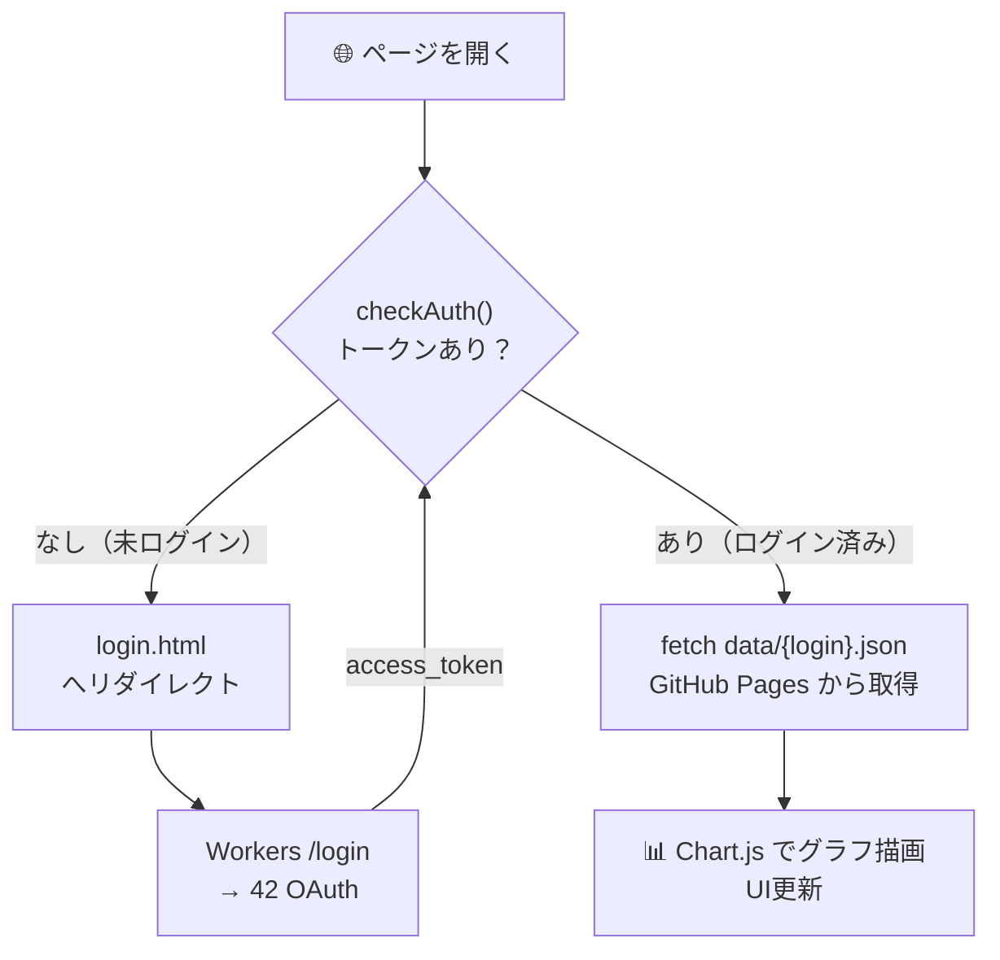
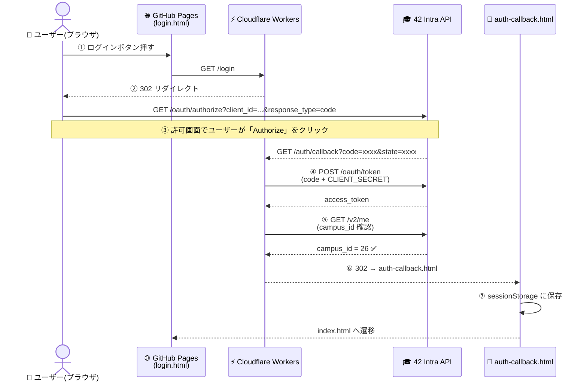
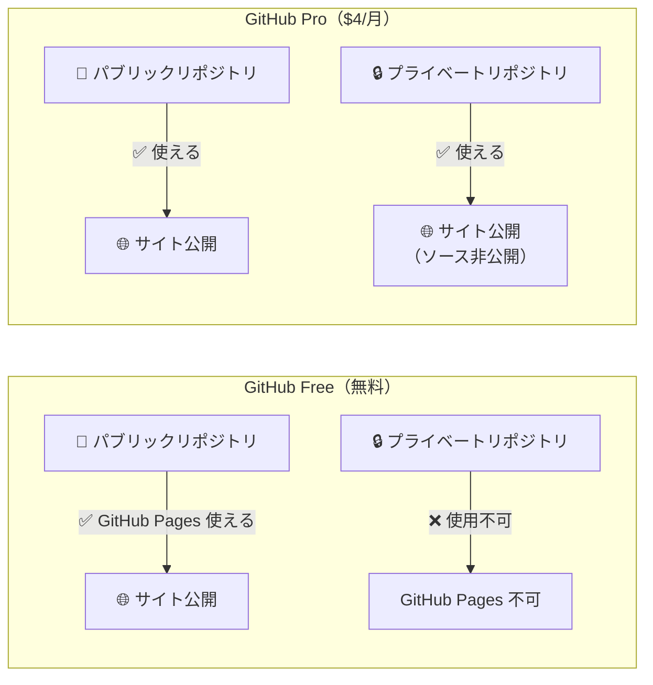
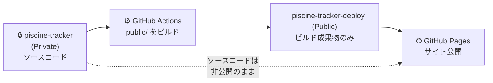

# Piscine Tracker

42 Tokyo Piscine（集中プログラミング教育）の学習進捗をリアルタイムで可視化するウェブアプリケーション。

- **個人ダッシュボード** — 自分の学習時間・進捗率・プロジェクト状況
- **全体ダッシュボード** — 全Piscine生のオンライン/オフライン状況
- **統計分析** — 偏差値分布・ランキング表示

> **対象ユーザー**: 42 Tokyo Piscine 参加者（2026年2月期）

---

## 目次

1. [システム全体構成](#1-システム全体構成)
2. [ディレクトリ構造](#2-ディレクトリ構造)
3. [各コンポーネント解説](#3-各コンポーネント解説)
4. [データの流れ](#4-データの流れ)
5. [認証フロー詳解](#5-認証フロー詳解)
6. [GitHub Pages の公開設定について](#6-github-pages-の公開設定について)
7. [ソースコードを非公開にする方法](#7-ソースコードを非公開にする方法)
8. [ローカルで動かす方法](#8-ローカルで動かす方法)
9. [新しいPiscine向けセットアップ](#9-新しいpiscine向けセットアップ)
10. [GitHub Actions の手動実行](#10-github-actions-の手動実行)
11. [トラブルシューティング](#11-トラブルシューティング)
12. [技術スタック一覧](#12-技術スタック一覧)

---

## 1. システム全体構成

### アーキテクチャ図



### コンポーネント役割一覧

| コンポーネント | 技術 | 役割 | 費用 |
|---|---|---|---|
| フロントエンド | HTML/CSS/JS | UI表示・認証処理 | 無料（GitHub Pages） |
| 認証プロキシ | Cloudflare Workers | OAuthのcode→token交換 | 無料（10万回/日） |
| データ取得 | Python + GitHub Actions | 42 APIからJSON生成 | 無料（2000分/月） |
| 静的ホスティング | GitHub Pages | HTMLとJSONファイルを配信 | 無料（パブリックリポジトリ） |
| ログ保存 | Cloudflare KV | ログイン記録の永続化 | 無料（1GB） |

---

## 2. ディレクトリ構造

```
piscine-tracker/
│
├── 📂 .github/
│   └── 📂 workflows/
│       ├── 📄 deploy-static.yml    # git push時にGitHub Pagesへデプロイ
│       └── 📄 update-data.yml      # スケジュール実行でデータ自動更新
│
├── 📂 public/                      # GitHub Pages で公開されるディレクトリ
│   ├── 📄 index.html               # 個人ダッシュボード（自分の進捗）
│   ├── 📄 login.html               # ログインページ
│   ├── 📄 dashboard.html           # 全体ダッシュボード（全員の状況）
│   ├── 📄 stats.html               # 統計・偏差値ランキング
│   ├── 📄 admin.html               # 管理者画面（ログイン記録閲覧）
│   ├── 📄 auth-callback.html       # OAuthコールバック受け取り専用
│   ├── 📄 auth.js                  # 認証共通モジュール（全ページで読み込む）
│   ├── 📄 data.json                # 全員分の集計データ（dashboard.htmlが使用）
│   └── 📂 data/
│       ├── 📄 atokunag.json        # atokunagの個人データ
│       ├── 📄 bshoda.json          # bshodaの個人データ
│       └── 📄 ...（147ファイル）   # 各Piscine生の個人データ
│
├── 📂 scripts/
│   └── 📄 fetch_data.py            # 42 API からデータを取得するスクリプト
│
├── 📂 workers/                     # Cloudflare Workers（Node.js ランタイム）
│   ├── 📄 index.js                 # Workers のメイン処理（OAuth プロキシ）
│   ├── 📄 wrangler.toml            # Cloudflare のデプロイ設定
│   └── 📄 SETUP.md                 # Workers の初期セットアップ手順
│
├── 📄 .env.example                 # 環境変数のテンプレート（秘密情報は書かない）
├── 📄 requirements.txt             # Python ライブラリ一覧
├── 📄 render.yaml                  # Render.com 設定（現在は未使用）
└── 📄 server.py                    # Render.com 用Pythonサーバー（現在は未使用）
```

> **注意**: `data.json` と `data/*.json` は `.gitignore` には入っておらず、
> GitHub Actions が自動的に gh-pages ブランチに書き込む。
> `main` ブランチには含まれない（コード変更と分離）。

---

## 3. 各コンポーネント解説

### 3.1 フロントエンド（`public/` ディレクトリ）

#### `auth.js` — 認証共通モジュール

全ページが読み込む認証ライブラリ。以下の機能を提供する:

```
auth.js の主な関数:
  getToken()      → sessionStorage からアクセストークンを取得
  setToken(t)     → sessionStorage にトークンを保存
  clearSession()  → ログアウト（sessionStorage をクリア）
  fetchMe(token)  → 42 API /v2/me でトークンが有効か確認
  checkAuth()     → 認証チェック（キャッシュ付き、42 API を毎回呼ばない）
  requireAuth()   → 認証必須ページ用（未ログインなら login.html へ飛ばす）
  loginWith42()   → Cloudflare Workers /login へリダイレクト
  logout()        → セッションクリア後 login.html へ
  injectUserBar() → 右上にアバター+ユーザー名を表示
```

**なぜ sessionStorage を使うのか？**
- `localStorage` は タブをまたいで共有されてしまう
- `sessionStorage` は タブを閉じると自動消去 → セキュリティが高い
- トークンはパスワードと同等の機密情報なので慎重に扱う

#### `index.html` — 個人ダッシュボード

ログイン後に `data/{自分のlogin}.json` を取得して表示する。

```
表示内容:
  ┌─────────────────────────────────┐
  │  [進捗リング] 進捗率 %           │  ← SVGで描いた円グラフ
  │                                 │
  │  総学習時間  目標時間  残り必要  │  ← 3カード
  │                                 │
  │  📊 日別学習時間 (棒グラフ)     │  ← Chart.js
  │                                 │
  │  📋 プロジェクト一覧            │  ← in_progress → validated 順
  └─────────────────────────────────┘
```

#### `dashboard.html` — 全体ダッシュボード

`data.json` を取得して全学生を表示する。データはサーバー側で更新済みのものを使う（42 API を直接呼ばない）。

```
表示内容:
  ● オンライン (x人) — 現在クラスターにいる学生（座席情報あり）
  ○ オフライン (x人) — 不在の学生
  各カード: アバター、login名、総時間、偏差値
```

#### `stats.html` — 統計分析

偏差値の分布・ランキングを表示する。

#### `admin.html` — 管理者画面

ログイン記録・同意記録を管理者のみ閲覧できる。Cloudflare Workers の `/api/logs` と `/api/consents` を呼ぶ。

---

### 3.2 データ取得（`scripts/fetch_data.py`）

GitHub Actions から呼び出されるスクリプト。**1日16回**自動実行される。



**偏差値の計算式**:
```
偏差値 = 50 + 10 × (自分の値 - 平均値) / 標準偏差
```
- 平均が 50、全体の約68% が 40〜60 の範囲に収まる
- 70以上 = 上位2.3%（かなり優秀）
- 30以下 = 下位2.3%

---

### 3.3 認証プロキシ（`workers/index.js`）

**なぜ Cloudflare Workers が必要なのか？**

```
問題: GitHub Pages は静的ファイルしか配信できない。
     42 OAuth は Authorization Code Flow を使う。
     このフローでは「code → token 交換」をサーバー側で行う必要がある。
     (理由: CLIENT_SECRET をブラウザに渡してはいけないから)

解決: Cloudflare Workers がサーバー役を担う。
     ブラウザ ↔ Workers ↔ 42 API の仲介をする。
```

```
Workers のエンドポイント:
  GET  /login          → 42 OAuth の認可画面へリダイレクト
  GET  /auth/callback  → code を受け取り access_token に交換
                         campus_id == 26 (42 Tokyo) のみ許可
                         → auth-callback.html#access_token=xxx へリダイレクト
  POST /api/log        → ログイン記録を KV に保存
  POST /api/consent    → 同意記録を KV に保存
  GET  /api/logs       → ログイン記録一覧（管理者のみ）
  GET  /api/consents   → 同意記録一覧（管理者のみ）
```

---

### 3.4 GitHub Actions

#### `update-data.yml` — データ自動更新

```yaml
スケジュール:
  JST  9:00〜21:00 (UTC 0:00〜12:00): 毎時1回 → 13回/日
  JST 21:00〜 9:00 (UTC 12:00〜24:00): 3時間ごと → 3回/日
  合計: 16回/日 × 約1.5分 = 約24分/日（月2000分制限に余裕あり）
```

手動実行も可能: GitHub の Actions タブ → "Update Piscine Data" → "Run workflow"

#### `deploy-static.yml` — コード変更時のデプロイ

```
git push → main ブランチ の場合のみ動作:
  1. gh-pages ブランチから最新の data.json と data/*.json を復元
     (コード変更でデータが消えないようにする)
  2. public/ を GitHub Pages にデプロイ
```

**なぜデータを復元する手順が必要なのか？**
```
main ブランチには data.json はない（コードだけ）
gh-pages ブランチには最新の data.json がある（GitHub Actions が書いた）
→ git push 時に gh-pages から data を引っ張ってきて、一緒にデプロイする
```

---

## 4. データの流れ

### データ更新サイクル（毎時）



### ユーザーがページを開いたとき



### JSONデータ構造

#### `public/data.json`（全体ダッシュボード用）

```json
{
  "online": [
    {
      "login": "ttanihir",
      "display_name": "Takahiro Tanihira",
      "total_hours": 325.28,
      "level": 7.8,
      "composite_deviation": 64.8,
      "host": "c1r5s5",
      "cluster": "c1",
      "seat": "r5s5",
      "begin_at": "2026-02-23T08:02:07.554Z"
    }
  ],
  "offline": [ ... ],
  "total_students": 147,
  "total_online": 12,
  "cached_at": "2026-02-24T10:00:00+09:00"
}
```

#### `public/data/{login}.json`（個人ダッシュボード用）

```json
{
  "login": "example_user",
  "display_name": "Example User",
  "level": 5.12,
  "total_logged_hours": 156.5,
  "progress_pct": 75.2,
  "on_track": true,
  "remaining_days": 4.0,
  "remaining_hours_needed": 51.5,
  "required_avg_remaining": 12.9,
  "composite_deviation": 62.3,
  "daily": [
    { "date": "2026-02-02", "weekday": "Mon", "hours": 9.5, "met_target": true },
    ...
  ],
  "projects": [
    { "name": "Shell 00", "status": "finished", "validated": true, "final_mark": 100 },
    { "name": "Shell 01", "status": "in_progress", "validated": false }
  ]
}
```

---

## 5. 認証フロー詳解



**なぜ Authorization Code Flow を使うのか？**
- Implicit Flow（トークンを直接URLに返す）は非推奨（セキュリティリスク）
- Authorization Code Flow は一時的な `code` を使い、サーバー側でトークン交換する
- `CLIENT_SECRET` をブラウザに公開せずに済む

---

## 6. GitHub Pages の公開設定について

### 結論: **無料プランではパブリックリポジトリが必須**



**このプロジェクトでの現状**:
- リポジトリは **パブリック** → GitHub Pages が無料で使える
- サイトURL: https://tsunanko.github.io/piscine-tracker/
- ソースコードも誰でも見える状態

---

## 7. ソースコードを非公開にする方法

### 選択肢の比較

| 方法 | コスト | ソースコード | サイト公開 | 難易度 |
|---|---|---|---|---|
| **現状（パブリックリポジトリ）** | 無料 | 全員が見える | ✅ | — |
| **GitHub Pro** | $4/月 | 非公開 | ✅ | 低（プランアップグレードのみ） |
| **Cloudflare Pages** | 無料 | 非公開可 | ✅ | 中（設定変更が必要） |
| **デプロイ専用リポジトリ分離** | 無料 | 非公開 | ✅ | 高（仕組みが複雑） |
| **JS難読化** | 無料 | 読みにくい（完全には隠せない） | ✅ | 低 |

---

### 方法A: GitHub Pro ($4/月)

最も簡単。リポジトリを Private にするだけ。

```
1. GitHub.com → Settings → Billing → GitHub Pro にアップグレード
2. リポジトリ設定 → Danger Zone → "Change repository visibility"
3. Private に変更
4. Settings → Pages で有効化（Proなら Private でも使える）
```

---

### 方法B: Cloudflare Pages（無料・おすすめ）

GitHub Pages の代わりに Cloudflare Pages でホスティングする。
Cloudflare Pages は**プライベートリポジトリから無料でデプロイできる**。

```
1. リポジトリを Private に変更（GitHub）
2. Cloudflare ダッシュボード → Pages → "Create a project"
3. GitHub アカウント連携 → piscine-tracker リポジトリを選択
4. Build settings:
     Build command: (なし — 静的ファイルのみ)
     Build output directory: public
5. Save and Deploy
```

**デプロイ後のURL変更が必要な箇所**:
```javascript
// auth.js
const REDIRECT_URI = 'https://your-project.pages.dev/auth-callback.html';

// workers/index.js
const GITHUB_PAGES_URL = 'https://your-project.pages.dev';
```

---

### 方法C: デプロイ専用リポジトリ分離（無料・高度）

ソース（Private）とデプロイ（Public）を別リポジトリに分ける。



```yaml
# deploy-static.yml に追記するイメージ
- name: Deploy to public repo
  uses: peaceiris/actions-gh-pages@v4
  with:
    deploy_key: ${{ secrets.DEPLOY_KEY }}
    external_repository: tsunanko/piscine-tracker-deploy
    publish_dir: ./public
```

---

### 方法D: JS難読化（簡易・完全には隠せない）

コードを読みにくくするだけ（完全な秘匿は不可）。

```bash
# uglify-js でminify+難読化
npm install -g uglify-js
uglifyjs public/auth.js -c -m -o public/auth.min.js
```

> **注意**: 難読化されたコードはブラウザの開発者ツールで
> pretty-print すれば復元できる。秘密情報の保護にはならない。

---

## 8. ローカルで動かす方法

### 前提条件

```bash
# Python 3.11 以上
python3 --version

# pip ライブラリ
pip install requests
```

### 静的サーバーを起動（フロントエンド確認用）

```bash
# 方法1: Claude Code のプレビュー機能
# .claude/launch.json に設定済み → Claude Code から "static-server" を起動

# 方法2: Python の標準サーバー
cd /path/to/piscine-tracker
python3 -m http.server 8765 --directory public

# → http://localhost:8765 でアクセス
```

> **注意**: ローカルでは42 OAuth が使えない（Redirect URI が本番URL固定）。
> ローカルテストは主にJSONデータとUIの見た目確認のみ。

### データ取得スクリプトをローカル実行

```bash
# .env ファイルを作成（.gitignore で除外済み）
cat > .env << EOF
CLIENT_ID=your_42_client_id
CLIENT_SECRET=your_42_client_secret
EOF

# スクリプト実行（public/data/*.json が更新される）
python3 scripts/fetch_data.py
```

### Cloudflare Workers をローカル実行

```bash
cd workers
npx wrangler dev
# → http://localhost:8787 でアクセス可能
```

---

## 9. 新しいPiscine向けセットアップ

次のPiscine期（来年度など）に向けて設定を更新する手順。

### Step 1: Piscine期間の更新（`scripts/fetch_data.py`）

```python
# 以下の値を更新する
PISCINE_START = datetime(2027, 2, 1, 0, 0, 0, tzinfo=JST)   # 開始日
PISCINE_END   = datetime(2027, 2, 28, 0, 0, 0, tzinfo=JST)  # 終了日（翌月1日）
PISCINE_DAYS  = 27  # 実際の日数を計算して設定
TARGET_HOURS_PER_DAY = 8  # 1日の目標時間（変えなくてOK）
```

### Step 2: 古いデータの削除

```bash
# 古い個人JSONファイルを削除
rm -f public/data/*.json
rm -f public/data.json

# gh-pages ブランチのデータもリセットが必要な場合:
git checkout gh-pages
rm -f data/*.json data.json
git add -A
git commit -m "chore: reset data for new piscine"
git push origin gh-pages
git checkout main
```

### Step 3: GitHub Secrets の確認

```
GitHub リポジトリ → Settings → Secrets and variables → Actions

必要なシークレット:
  CLIENT_ID      → 42 Intra の OAuth App UID
  CLIENT_SECRET  → 42 Intra の OAuth App Secret
```

### Step 4: 42 Intra OAuth App の確認

```
42 Intra → 設定 → API → Applications

確認項目:
  Redirect URI: https://piscine-tracker.tsunanko.workers.dev/auth/callback
  Scopes: public
```

### Step 5: Cloudflare Workers の更新（必要な場合）

```bash
cd workers
wrangler deploy
```

---

## 10. GitHub Actions の手動実行

### データを今すぐ更新したい場合

```
1. GitHub リポジトリ → "Actions" タブ
2. 左側のワークフロー一覧 → "Update Piscine Data"
3. 右側の "Run workflow" ボタン → "Run workflow" をクリック
4. 約1〜2分後に完了 → サイトに反映
```

### Git コマンドで手動トリガー（ローカルから）

```bash
# GitHub CLI が必要
gh workflow run update-data.yml

# 実行状況を確認
gh run list --workflow=update-data.yml
```

### 実行ログの確認

```
GitHub → Actions → Update Piscine Data → 最新の実行 → fetch-and-deploy ジョブ
```

ログで確認できること:
- 何人のPiscine生が見つかったか
- 各APIリクエストのページ数
- エラーが出た学生（`[ERROR] login: ...`）
- 偏差値計算の平均・標準偏差

---

## 11. トラブルシューティング

### サイトにアクセスできない / 真っ白

```
確認1: GitHub Pages が有効になっているか
  → リポジトリ Settings → Pages → Source が "gh-pages" になっているか

確認2: gh-pages ブランチが存在するか
  → git branch -r | grep gh-pages

確認3: GitHub Actions が正常終了しているか
  → Actions タブでエラーを確認
```

### ログインできない / 認証エラー

```
確認1: Cloudflare Workers が動いているか
  → https://piscine-tracker.tsunanko.workers.dev にアクセス

確認2: 42 Intra OAuth App の設定
  → Redirect URI が Workers URL と一致するか

確認3: Workers の Secrets
  → wrangler secret list
     (FORTY_TWO_CLIENT_ID, FORTY_TWO_CLIENT_SECRET, REDIRECT_URI が必要)

確認4: ブラウザのコンソールエラー
  → F12 → Console でエラーメッセージを確認
```

### データが古い / 更新されない

```
確認1: GitHub Actions が失敗していないか
  → Actions タブ → Update Piscine Data

確認2: API レート制限
  → 42 API は 1200req/分 の制限がある
  → ログに "429 Too Many Requests" が出ていないか

確認3: CLIENT_ID / CLIENT_SECRET の有効期限
  → 42 Intra の OAuth App を確認

手動でデータ更新:
  → Actions タブ → "Run workflow"
```

### 偏差値がおかしい

```
原因: Piscine生が少ない（標準偏差が0になる）とき
     全員 50.0 になる（calc_deviation が std=0 の場合を処理済み）

原因: 時間偏差値の母集団が少ない
     → 直近7日間に1h以上来た学生が2人未満の場合
     → Piscine 開始直後などに発生しうる
```

---

## 12. 技術スタック一覧

### フロントエンド
| 技術 | バージョン | 用途 |
|---|---|---|
| HTML5 | — | ページ構造 |
| CSS3 | — | スタイリング（CSS変数でダークテーマ） |
| Vanilla JS | ES2020+ | UI操作・API呼び出し |
| Chart.js | 4.4.0 | 棒グラフ・折れ線グラフ |
| SVG | — | 円形プログレスバー |

### バックエンド・インフラ
| 技術 | 用途 |
|---|---|
| Cloudflare Workers | OAuth認証プロキシ（サーバーレス） |
| Cloudflare KV | ログイン記録の永続化（KV Store） |
| GitHub Pages | 静的ファイルホスティング |
| GitHub Actions | 定期データ更新・自動デプロイ |

### データ取得
| 技術 | バージョン | 用途 |
|---|---|---|
| Python | 3.11 | データ取得スクリプト |
| requests | latest | HTTP クライアント |
| statistics | stdlib | 偏差値計算 |

### 42 Intra API
| エンドポイント | 用途 |
|---|---|
| `/oauth/authorize` | OAuth 認可画面 |
| `/oauth/token` | code → access_token 交換 |
| `/v2/me` | 現在のユーザー情報取得・トークン検証 |
| `/v2/cursus/{id}/cursus_users` | Piscine生一覧（level付き） |
| `/v2/campus/{id}/locations` | アクティブな座席情報 |
| `/v2/users/{login}/locations_stats` | 日別滞在時間 |
| `/v2/users/{login}/projects_users` | プロジェクト状況 |
| `/v2/users/{login}/scale_teams` | レビュー回数 |

---

## 関連リンク

- [サイト（GitHub Pages）](https://tsunanko.github.io/piscine-tracker/)
- [Cloudflare Workers](https://piscine-tracker.tsunanko.workers.dev/)
- [42 Intra API ドキュメント](https://api.intra.42.fr/apidoc)
- [Cloudflare Workers ドキュメント](https://developers.cloudflare.com/workers/)
- [GitHub Actions ドキュメント](https://docs.github.com/ja/actions)
- [Chart.js ドキュメント](https://www.chartjs.org/docs/latest/)
